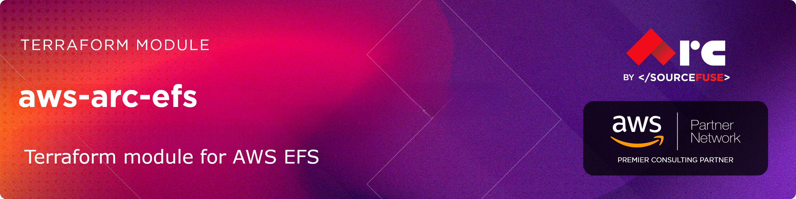

# AWS Terraform Module
# [terraform-aws-arc-efs](https://github.com/sourcefuse/terraform-aws-arc-efs)

<a href="https://github.com/sourcefuse/terraform-aws-arc-efs/releases/latest"></a> <a href="https://github.com/sourcefuse/terraform-aws-arc-efs/commits"></a>  

[](https://sonarcloud.io/summary/new_code?id=sourcefuse_terraform-aws-arc-efs)

---

# terraform-aws-module-template

## Overview

SourceFuse AWS Reference Architecture (ARC) Terraform module for managing AWS Elastic File System.

## Usage
### Basic Example

```hcl
module "efs" {
  source = "sourcefuse/arc-efs/aws"

  namespace   = "arc"
  environment = "dev"
  name        = "my-efs"

  # Mount targets
  mount_targets = {
    "us-east-1a" = {
      subnet_id = "subnet-12345678"
    }
    "us-east-1b" = {
      subnet_id = "subnet-87654321"
    }
  }

  # Security configuration
  mount_target_security_group_vpc_id = "vpc-12345678"
  allowed_cidr_blocks               = ["10.0.0.0/16"]

  tags = {
    Project = "MyProject"
  }
}
```

### Advanced Example with Access Points

```hcl
module "efs" {
  source = "sourcefuse/arc-efs/aws"

  namespace   = "arc"
  environment = "prod"
  name        = "app-storage"

  # High-performance configuration
  performance_mode                = "maxIO"
  throughput_mode                 = "provisioned"
  provisioned_throughput_in_mibps = 500

  # Encryption
  encrypted  = true
  kms_key_id = aws_kms_key.efs.arn

  # Mount targets
  mount_targets = {
    "us-east-1a" = { subnet_id = "subnet-12345678" }
    "us-east-1b" = { subnet_id = "subnet-87654321" }
  }

  # Security configuration
  mount_target_security_group_vpc_id = "vpc-12345678"
  allowed_cidr_blocks               = ["10.0.0.0/8"]

  # Access points
  access_points = {
    web_app = {
      path = "/web"
      creation_info = {
        owner_gid   = 1001
        owner_uid   = 1001
        permissions = "755"
      }
      posix_user = {
        gid = 1001
        uid = 1001
      }
    }
    database = {
      path = "/db"
      creation_info = {
        owner_gid   = 999
        owner_uid   = 999
        permissions = "750"
      }
    }
  }

  # Lifecycle policy for cost optimization
  lifecycle_policy = {
    transition_to_ia = "AFTER_30_DAYS"
    transition_to_primary_storage_class = "AFTER_1_ACCESS"
  }

  # Cross-region replication
  replication_configuration = {
    destination = {
      region = "us-west-2"
    }
  }

  tags = {
    Environment = "Production"
    Compliance  = "Required"
  }
}
```

## Examples

This module includes several comprehensive examples:

- **[Basic](./examples/basic/)** - Simple EFS setup with mount targets
- **[With Access Points](./examples/with-access-points/)** - Multiple access points for different applications
- **[With Replication](./examples/with-replication/)** - Cross-region replication for disaster recovery
- **[Complete](./examples/complete/)** - All features including encryption, lifecycle policies, and access points

<!-- BEGIN_TF_DOCS -->
## Requirements

| Name | Version |
|------|---------|
| <a name="requirement_terraform"></a> [terraform](#requirement\_terraform) | >= 1.3 |
| <a name="requirement_aws"></a> [aws](#requirement\_aws) | >= 5.0, < 7.0 |

## Providers

| Name | Version |
|------|---------|
| <a name="provider_aws"></a> [aws](#provider\_aws) | 6.25.0 |

## Modules

No modules.

## Resources

| Name | Type |
|------|------|
| [aws_efs_access_point.this](https://registry.terraform.io/providers/hashicorp/aws/latest/docs/resources/efs_access_point) | resource |
| [aws_efs_backup_policy.this](https://registry.terraform.io/providers/hashicorp/aws/latest/docs/resources/efs_backup_policy) | resource |
| [aws_efs_file_system.this](https://registry.terraform.io/providers/hashicorp/aws/latest/docs/resources/efs_file_system) | resource |
| [aws_efs_file_system_policy.this](https://registry.terraform.io/providers/hashicorp/aws/latest/docs/resources/efs_file_system_policy) | resource |
| [aws_efs_mount_target.this](https://registry.terraform.io/providers/hashicorp/aws/latest/docs/resources/efs_mount_target) | resource |
| [aws_efs_replication_configuration.this](https://registry.terraform.io/providers/hashicorp/aws/latest/docs/resources/efs_replication_configuration) | resource |
| [aws_security_group.mount_target](https://registry.terraform.io/providers/hashicorp/aws/latest/docs/resources/security_group) | resource |
| [aws_security_group_rule.additional](https://registry.terraform.io/providers/hashicorp/aws/latest/docs/resources/security_group_rule) | resource |
| [aws_security_group_rule.nfs_ingress_cidr](https://registry.terraform.io/providers/hashicorp/aws/latest/docs/resources/security_group_rule) | resource |
| [aws_security_group_rule.nfs_ingress_sg](https://registry.terraform.io/providers/hashicorp/aws/latest/docs/resources/security_group_rule) | resource |

## Inputs

| Name | Description | Type | Default | Required |
|------|-------------|------|---------|:--------:|
| <a name="input_access_points"></a> [access\_points](#input\_access\_points) | A map of EFS access points to create | <pre>map(object({<br/>    path = optional(string, "/")<br/>    creation_info = optional(object({<br/>      owner_gid   = number<br/>      owner_uid   = number<br/>      permissions = string<br/>    }))<br/>    posix_user = optional(object({<br/>      gid            = number<br/>      uid            = number<br/>      secondary_gids = optional(list(number))<br/>    }))<br/>    tags = optional(map(string), {})<br/>  }))</pre> | `{}` | no |
| <a name="input_additional_security_group_rules"></a> [additional\_security\_group\_rules](#input\_additional\_security\_group\_rules) | A map of additional security group rules to add to the mount target security group | <pre>map(object({<br/>    type             = string<br/>    from_port        = number<br/>    to_port          = number<br/>    protocol         = string<br/>    cidr_blocks      = optional(list(string))<br/>    ipv6_cidr_blocks = optional(list(string))<br/>    prefix_list_ids  = optional(list(string))<br/>    security_groups  = optional(list(string))<br/>    self             = optional(bool)<br/>    description      = optional(string)<br/>  }))</pre> | `{}` | no |
| <a name="input_allowed_cidr_blocks"></a> [allowed\_cidr\_blocks](#input\_allowed\_cidr\_blocks) | List of CIDR blocks allowed to access EFS | `list(string)` | `[]` | no |
| <a name="input_allowed_security_group_ids"></a> [allowed\_security\_group\_ids](#input\_allowed\_security\_group\_ids) | List of security group IDs allowed to access EFS | `list(string)` | `[]` | no |
| <a name="input_availability_zone_name"></a> [availability\_zone\_name](#input\_availability\_zone\_name) | AWS Availability Zone in which to create the file system. Used to create a file system that uses One Zone storage classes | `string` | `null` | no |
| <a name="input_bypass_policy_lockout_safety_check"></a> [bypass\_policy\_lockout\_safety\_check](#input\_bypass\_policy\_lockout\_safety\_check) | A flag to indicate whether to bypass the aws\_efs\_file\_system\_policy lockout safety check | `bool` | `false` | no |
| <a name="input_create_mount_target_security_group"></a> [create\_mount\_target\_security\_group](#input\_create\_mount\_target\_security\_group) | Create a security group for mount targets | `bool` | `true` | no |
| <a name="input_creation_token"></a> [creation\_token](#input\_creation\_token) | A unique name (a maximum of 64 characters are allowed) used as reference when creating the EFS | `string` | `null` | no |
| <a name="input_enable_backup_policy"></a> [enable\_backup\_policy](#input\_enable\_backup\_policy) | A boolean that indicates whether or not to apply Backup Policy to the file system | `bool` | `true` | no |
| <a name="input_encrypted"></a> [encrypted](#input\_encrypted) | If true, the disk will be encrypted | `bool` | `true` | no |
| <a name="input_kms_key_id"></a> [kms\_key\_id](#input\_kms\_key\_id) | The ARN for the KMS encryption key. When specifying kms\_key\_id, encrypted needs to be set to true | `string` | `null` | no |
| <a name="input_lifecycle_policy"></a> [lifecycle\_policy](#input\_lifecycle\_policy) | A file system lifecycle policy object | <pre>object({<br/>    transition_to_ia                    = optional(string)<br/>    transition_to_primary_storage_class = optional(string)<br/>  })</pre> | `{}` | no |
| <a name="input_mount_target_security_group_description"></a> [mount\_target\_security\_group\_description](#input\_mount\_target\_security\_group\_description) | Description of the mount target security group | `string` | `"EFS mount target security group"` | no |
| <a name="input_mount_target_security_group_name"></a> [mount\_target\_security\_group\_name](#input\_mount\_target\_security\_group\_name) | Name of the mount target security group | `string` | `null` | no |
| <a name="input_mount_target_security_group_vpc_id"></a> [mount\_target\_security\_group\_vpc\_id](#input\_mount\_target\_security\_group\_vpc\_id) | ID of the VPC where mount target security group will be created | `string` | `null` | no |
| <a name="input_mount_targets"></a> [mount\_targets](#input\_mount\_targets) | A map of mount target configurations where key is the AZ name | <pre>map(object({<br/>    subnet_id       = string<br/>    security_groups = optional(list(string), [])<br/>  }))</pre> | `{}` | no |
| <a name="input_name"></a> [name](#input\_name) | Name of the EFS file system | `string` | n/a | yes |
| <a name="input_performance_mode"></a> [performance\_mode](#input\_performance\_mode) | The file system performance mode. Can be either `generalPurpose` or `maxIO` | `string` | `"generalPurpose"` | no |
| <a name="input_policy"></a> [policy](#input\_policy) | A valid JSON formatted policy for the EFS file system | `string` | `null` | no |
| <a name="input_provisioned_throughput_in_mibps"></a> [provisioned\_throughput\_in\_mibps](#input\_provisioned\_throughput\_in\_mibps) | The throughput, measured in MiB/s, that you want to provision for the file system. Only applicable with throughput\_mode set to provisioned | `number` | `null` | no |
| <a name="input_replication_configuration"></a> [replication\_configuration](#input\_replication\_configuration) | A map of replication configuration | <pre>object({<br/>    destination = object({<br/>      region                 = optional(string)<br/>      availability_zone_name = optional(string)<br/>      kms_key_id             = optional(string)<br/>    })<br/>  })</pre> | `null` | no |
| <a name="input_tags"></a> [tags](#input\_tags) | Additional tags (e.g. `{'BusinessUnit': 'XYZ'}`) | `map(string)` | `{}` | no |
| <a name="input_throughput_mode"></a> [throughput\_mode](#input\_throughput\_mode) | Throughput mode for the file system. Defaults to bursting. Valid values: `bursting`, `elastic`, `provisioned` | `string` | `"bursting"` | no |

## Outputs

| Name | Description |
|------|-------------|
| <a name="output_access_point_arns"></a> [access\_point\_arns](#output\_access\_point\_arns) | List of access point ARNs |
| <a name="output_access_point_ids"></a> [access\_point\_ids](#output\_access\_point\_ids) | List of access point IDs |
| <a name="output_access_points"></a> [access\_points](#output\_access\_points) | Map of access points created |
| <a name="output_backup_policy_id"></a> [backup\_policy\_id](#output\_backup\_policy\_id) | ID of the backup policy |
| <a name="output_complete_efs_config"></a> [complete\_efs\_config](#output\_complete\_efs\_config) | Complete EFS configuration for reference |
| <a name="output_efs_arn"></a> [efs\_arn](#output\_efs\_arn) | ARN of the EFS file system |
| <a name="output_efs_creation_token"></a> [efs\_creation\_token](#output\_efs\_creation\_token) | Creation token of the EFS file system |
| <a name="output_efs_dns_name"></a> [efs\_dns\_name](#output\_efs\_dns\_name) | DNS name of the EFS file system |
| <a name="output_efs_encrypted"></a> [efs\_encrypted](#output\_efs\_encrypted) | Whether the EFS file system is encrypted |
| <a name="output_efs_id"></a> [efs\_id](#output\_efs\_id) | ID of the EFS file system |
| <a name="output_efs_kms_key_id"></a> [efs\_kms\_key\_id](#output\_efs\_kms\_key\_id) | The ARN for the KMS encryption key used to encrypt the EFS file system |
| <a name="output_efs_owner_id"></a> [efs\_owner\_id](#output\_efs\_owner\_id) | AWS account ID that created the file system |
| <a name="output_efs_performance_mode"></a> [efs\_performance\_mode](#output\_efs\_performance\_mode) | Performance mode of the EFS file system |
| <a name="output_efs_size_in_bytes"></a> [efs\_size\_in\_bytes](#output\_efs\_size\_in\_bytes) | Current byte count used by the file system |
| <a name="output_efs_throughput_mode"></a> [efs\_throughput\_mode](#output\_efs\_throughput\_mode) | Throughput mode of the EFS file system |
| <a name="output_mount_target_dns_names"></a> [mount\_target\_dns\_names](#output\_mount\_target\_dns\_names) | List of mount target DNS names |
| <a name="output_mount_target_ids"></a> [mount\_target\_ids](#output\_mount\_target\_ids) | List of mount target IDs |
| <a name="output_mount_target_network_interface_ids"></a> [mount\_target\_network\_interface\_ids](#output\_mount\_target\_network\_interface\_ids) | List of mount target network interface IDs |
| <a name="output_mount_targets"></a> [mount\_targets](#output\_mount\_targets) | Map of mount targets created |
| <a name="output_replication_configuration_destination_file_system_id"></a> [replication\_configuration\_destination\_file\_system\_id](#output\_replication\_configuration\_destination\_file\_system\_id) | The file system ID of the replica |
| <a name="output_replication_configuration_id"></a> [replication\_configuration\_id](#output\_replication\_configuration\_id) | ID of the replication configuration |
| <a name="output_security_group_arn"></a> [security\_group\_arn](#output\_security\_group\_arn) | ARN of the mount target security group |
| <a name="output_security_group_id"></a> [security\_group\_id](#output\_security\_group\_id) | ID of the mount target security group |
| <a name="output_security_group_name"></a> [security\_group\_name](#output\_security\_group\_name) | Name of the mount target security group |
<!-- END_TF_DOCS -->

## Versioning  
This project uses a `.version` file at the root of the repo which the pipeline reads from and does a git tag.  

When you intend to commit to `main`, you will need to increment this version. Once the project is merged,
the pipeline will kick off and tag the latest git commit.  

## Development

### Prerequisites

- [terraform](https://learn.hashicorp.com/terraform/getting-started/install#installing-terraform)
- [terraform-docs](https://github.com/segmentio/terraform-docs)
- [pre-commit](https://pre-commit.com/#install)
- [golang](https://golang.org/doc/install#install)
- [golint](https://github.com/golang/lint#installation)

### Configurations

- Configure pre-commit hooks
  ```sh
  pre-commit install
  ```

### Versioning

while Contributing or doing git commit please specify the breaking change in your commit message whether its major,minor or patch

For Example

```sh
git commit -m "your commit message #major"
```
By specifying this , it will bump the version and if you don't specify this in your commit message then by default it will consider patch and will bump that accordingly

### Tests
- Tests are available in `test` directory
- Configure the dependencies
  ```sh
  cd test/
  go mod init github.com/sourcefuse/terraform-aws-refarch-<module_name>
  go get github.com/gruntwork-io/terratest/modules/terraform
  ```
- Now execute the test  
  ```sh
  go test -timeout  30m
  ```

## Authors

This project is authored by:
- SourceFuse ARC Team
